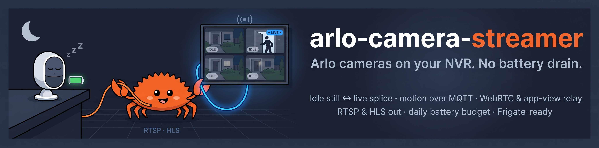

<p align="center">
  
</p>

# arlo-camera-streamer

[](https://github.com/YpNo/arlo-camera-streamer-rs/actions/workflows/ci.yml)
[](https://github.com/YpNo/arlo-camera-streamer-rs/releases/latest)
[](https://github.com/YpNo/arlo-camera-streamer-rs/pkgs/container/arlo-camera-streamer-rs)
[](https://hub.docker.com/r/ypno/arlo-camera-streamer-rs)
[](https://codecov.io/gh/YpNo/arlo-camera-streamer-rs)
[](https://sonarcloud.io/summary/new_code?id=YpNo_arlo-camera-streamer-rs)
[](https://github.com/YpNo/arlo-camera-streamer-rs)
[](https://gstreamer.freedesktop.org/)
[](https://crates.io/crates/arlo-rs)
[](LICENSE)

A Rust daemon that bridges battery-powered Arlo cameras to a 24/7 NVR
(Frigate, ZoneMinder, Shinobi, Home Assistant) via RTSP — without
draining the camera battery.

## Overview

Frigate expects a continuous RTSP stream so it can run motion detection
and recording. Arlo battery cameras are sleepy by design: a continuous
pull would flatten the battery in under 24 hours.

`arlo-camera-streamer` solves the contradiction by **decoupling
Frigate's pull from Arlo's push**:

| Phase | Frigate sees | Camera state |
|-------|--------------|--------------|
| Idle  | Looped JPEG / synthetic frame at 1 fps | Sleeping |
| Activating | Frame freezes briefly | `start_stream` in flight |
| Live  | Real H.264/H.265 from the camera, until `debounce_secs` after the last motion | Awake |
| Battery-protect | Idle frame returns | Sleeping (quota exhausted) |
| Viewed in app | You watch the camera in the Arlo app: the daemon relays the app's own stream, picture and sound (ADR 0007); if Arlo hands out none, the idle frame reads `LIVE IN ARLO APP`. Motion resumes when you close the app | Awake (because of you) |

The transition is driven by Arlo's **MQTT event bus**: when the camera
fires a motion event, the daemon negotiates a WebRTC session with Arlo's
gateway, splices the live H.264 into the persistent GStreamer pipeline,
and reverts to idle once the camera goes quiet, or as soon as the live
source itself dies (ADR 0004).

## Architecture

Hexagonal Rust workspace, six crates:

```
streamer-domain        — pure types & port traits (no I/O)
streamer-app           — orchestrator + state machine + budget tracker
streamer-infra-arlo    — adapter for the arlo-rs client
streamer-infra-media   — GStreamer pipelines + embedded RTSP server
streamer-infra-ops     — /metrics, /healthz, /readyz, /admin/*
streamer-bin           — composition root (the daemon binary)
```

Read [`crates/streamer-domain/src/port.rs`](./crates/streamer-domain/src/port.rs)
to see the contracts. The ADRs document the load-bearing decisions:

- [ADR index](./docs/adr/README.md) and the [validation record](./docs/VALIDATION.md) of what has run against a real camera.
- [ADR 0001 — Factory-restart splice](./docs/adr/0001-factory-restart-splice.md): *superseded by 0003*.
- [ADR 0002 — RTSP-only output for v1](./docs/adr/0002-rtsp-only-output-v1.md): *superseded by 0006 for HLS*; DASH stays out.
- [ADR 0003 — Seamless input-selector splice](./docs/adr/0003-seamless-input-selector-splice.md): one persistent pipeline per camera, idle and live swapped at a frame boundary, clients never disconnect.
- [ADR 0004 — Live-loss feedback](./docs/adr/0004-live-lost-feedback.md): a dead live source returns the camera to idle through the state machine, with its reason.
- [ADR 0005 — User views: observe, never compete](./docs/adr/0005-user-views-observe-never-compete.md): no WebRTC session of ours while the app views; Arlo's 14001 is handled without backoff.
- [ADR 0006 — HLS output](./docs/adr/0006-hls-output-via-loopback-segmenter.md): HLS is written by a loopback RTSP client of each camera, no re-encode.
- [ADR 0007 — Relay the user's app view](./docs/adr/0007-relay-the-users-app-view.md): a live view started in the Arlo app is relayed, picture and sound, from the RTSPS stream Arlo hands the app identity; no cooldown, no budget charge; the relay lets go of the stream every `user_view_probe_secs` so the camera can report whether the app still views.
- [ADR 0008 — Choosing the H.264 encoder per host](./docs/adr/0008-video-encoder-selection.md): `video_encoder = "auto"` dry-runs NVIDIA, Intel/AMD, V4L2 and x264 at boot and keeps the first that works.

## Prerequisites

- **Rust** ≥ 1.99.0 (`rustup toolchain install 1.99.0`; the MSRV follows arlo-rs).
- **GStreamer 1.22+** with the plugin set below.
  - `gstreamer1.0-plugins-base`
  - `gstreamer1.0-plugins-good` (also provides `gdkpixbufoverlay` for the idle thumbnail)
  - `gstreamer1.0-plugins-bad` (`webrtcbin`, DTLS/SRTP)
  - `gstreamer1.0-plugins-ugly`
  - `gstreamer1.0-libav` (`avdec_h264`, `avenc_aac`)
  - **`gstreamer1.0-nice`** — libnice ICE for `webrtcbin`. **Required for live streaming.** Without it, live fails at motion with `pipeline error: webrtcbin has no sink request pad` (the idle stream still works, which makes it easy to miss).
  - the `gst-rtsp-server` library (Debian: `libgstrtspserver-1.0-0`).
  - *Optional* GPU encoding plugins — Intel/AMD: `gstreamer1.0-vaapi` plus the VA drivers (`intel-media-va-driver` / `mesa-va-drivers`; the newer `va` plugin ships in `gstreamer1.0-plugins-bad`); Raspberry Pi 4 family: `v4l2h264enc` from `gstreamer1.0-plugins-good`; NVIDIA: `nvh264enc` from `gstreamer1.0-plugins-bad` with the driver libraries. `video_encoder = "auto"` picks whatever works (see [Performance](#performance), [ADR 0008](./docs/adr/0008-video-encoder-selection.md)).
- An Arlo cloud account with at least one camera.
- An IMAP mailbox you can poll for the Arlo MFA OTP, or be ready to
  type the OTP on stdin (cold-start only).

### Runtime dependencies — quick install

**Debian/Ubuntu:**

```bash
sudo apt-get update && sudo apt-get install -y \
  gstreamer1.0-plugins-base gstreamer1.0-plugins-good \
  gstreamer1.0-plugins-bad gstreamer1.0-plugins-ugly \
  gstreamer1.0-libav gstreamer1.0-nice \
  libgstrtspserver-1.0-0 gstreamer1.0-tools
# optional — Intel/AMD hardware H.264 encode:
sudo apt-get install -y gstreamer1.0-vaapi
```

**macOS (Homebrew):** the `gstreamer` formula bundles every plugin
above (including `gst-rtsp-server` and libnice) in one package.

```bash
brew install gstreamer
```

Sanity-check the WebRTC transport plugins are present (these are the
ones most often missing on a fresh box):

```bash
for e in webrtcbin nicesrc dtlssrtpenc srtpenc; do \
  printf '%-12s ' "$e"; gst-inspect-1.0 "$e" >/dev/null 2>&1 && echo OK || echo MISSING; done
```

## Installation

### From source

Building needs the GStreamer development headers on top of the runtime
plugins above, plus a C toolchain and libclang for the bindings
(Debian/Ubuntu names; the `Dockerfile` builder stage is the reference list):

```bash
sudo apt-get install -y build-essential pkg-config cmake nasm libclang-dev libssl-dev \
  libglib2.0-dev libgstreamer1.0-dev libgstreamer-plugins-base1.0-dev \
  libgstreamer-plugins-bad1.0-dev libgstrtspserver-1.0-dev
```

```bash
cargo build --release --package arlo-camera-streamer
sudo install -m 0755 target/release/arlo-camera-streamer /usr/local/bin/
```

### Docker (recommended)

The daemon ships as a container image only; no crate is published.
Every release pushes the same image, built from the `Dockerfile` at the
repo root (Debian 13 with GStreamer 1.26, non-root, no setuid binaries,
`tini` as PID 1, every GStreamer plugin the pipelines need, scanned with
Trivy before it is tagged), to GitHub's registry and to Docker Hub:

```bash
docker pull ghcr.io/ypno/arlo-camera-streamer-rs:v0.1.1
```

```bash
docker pull docker.io/ypno/arlo-camera-streamer-rs:v0.1.1
```

Tags: `v<version>` (pin this one), `latest` (the newest release), and
`sha-<commit>`, identical on both registries. Each tag is a manifest list
for `linux/amd64` and `linux/arm64` (Raspberry Pi 4 and 5, Apple silicon
hosts); `docker pull` picks the right one. To build it yourself instead:

```bash
docker build -t arlo-camera-streamer:dev .
```

## Configuration

Copy [`config/streamer.example.toml`](./config/streamer.example.toml)
to `/etc/arlo-streamer/streamer.toml` (or another preferred location) and edit the marked sections.
**Secrets never live in this file** — only the *names* of env vars
holding the values. The file is checked before anything starts: an
unknown key (a typo) is an error, two cameras may not share an
`arlo_device_id` or a `stream_name`, and the cooldown values must be in
range (`debounce_secs` and `max_continuous_live` 1 to 86400 s; the
budget and probe 0 to 86400 s).

| Section / key                       | Type           | Default              | Notes                                                    |
|-------------------------------------|----------------|----------------------|----------------------------------------------------------|
| `arlo.email`                        | string         | (required)           | Arlo cloud account email.                                |
| `arlo.password_env`                 | string         | (required)           | Env var name holding the password.                       |
| `arlo.session_cache_path`           | path           | (required)           | Persisted session token — survives restarts. The idle thumbnails live in a `thumbnails/` directory beside it (created owner-only at boot). |
| `arlo.watch_along_cert_sha256`      | hex string     | (unset)              | Pin the watch-along host's certificate (SHA-256) instead of verifying its chain; only when the log says the chain is not trusted (ADR 0007). |
| `arlo.app_version`                  | string         | `6.46.0`             | Arlo app version the daemon identifies as when fetching the stream of a view you started in the app (ADR 0007). |
| `arlo.mfa.kind`                     | `email`/`push`/`sms` | (required)     | Second factor. `email` and `push` run headless; `sms` prompts on stdin. |
| `arlo.mfa.host` / `.provider` / `.user` / `.password_env` / `.port` | strings | (port: 993) | IMAP mailbox for `kind = "email"`; without them the OTP is prompted on stdin. |
| `arlo.mfa.poll_interval_secs` / `.timeout_secs` | u64  | `3` / `120`          | Approval polling for `kind = "push"`.                    |
| `webrtc.ice_address_family`         | `dual`/`ipv4`  | `dual`               | ICE candidate gathering; `ipv4` when IPv6 to Arlo is broken. |
| `webrtc.live_stall_timeout_secs`    | u64            | `10` (floor 4)       | Seconds without inbound video before the live source is declared lost and the output returns to idle (ADR 0004). |
| `output.video_encoder`              | `auto`/`x264`/`va`/`vaapi`/`v4l2`/`nvenc` | `auto` | `auto` probes the host at boot (NVIDIA, Intel/AMD, V4L2, then x264); an explicit name fails the boot when it does not work (see Performance, ADR 0008). |
| `output.rtsp.bind`                  | `host:port`    | `0.0.0.0:8554`       | Embedded RTSP server.                                    |
| `output.metrics_bind`               | `host:port`    | `127.0.0.1:9090`     | Prometheus + healthchecks.                               |
| `output.admin_bind`                 | `host:port`    | `127.0.0.1:9091`     | `/admin/*` write API.                                    |
| `output.hls.dir`                    | path           | (off)                | Enables HLS: `<dir>/<stream_name>/index.m3u8` + segments (ADR 0006). Serve it with any web server. Keeps each camera's encoder running. |
| `output.hls.segment_secs`           | u32            | `2` (floor 1)        | Target segment length; segments cut at keyframes (every 2 s). |
| `output.hls.playlist_length`        | u32            | `10` (floor 3)       | Segments in the playlist; two more are kept on disk.      |
| `output.dash`                       | table          | (ignored)            | Parsed for compatibility, not supported: see ADR 0006.    |
| `[[cameras]]`                       | array          | `[]`                 | One block per camera — see example.                      |
| `cameras.codec_hint`                | `h264`/`h265`  | (auto)               | Skip first-stream codec detection.                       |
| `cameras.cooldown.debounce_secs`    | u64            | `60`                 | Hold-live debounce after last motion.                    |
| `cameras.cooldown.max_continuous_live` | u64         | `300`                | Hard cap on continuous live (battery protection); also caps a relayed app view when probing is off. |
| `cameras.cooldown.user_view_probe_secs` | u64        | `60`                 | How often a relayed app view is released for a few seconds to learn whether the app still views (our session keeps the camera streaming). `0` = never, cap only. |
| `cameras.cooldown.daily_live_budget` | u64           | `0`                  | `0` = unlimited; otherwise total live secs/day.          |
| `cameras.cooldown.budget_reset`     | `HH:MM`        | `00:00`              | Local-clock reset.                                       |

### Environment variables

| Variable | Purpose |
|----------|---------|
| `ARLO_PASSWORD` (or whatever you put in `arlo.password_env`) | **Required.** Arlo cloud password. |
| `ARLO_IMAP_PASSWORD` (or whatever you put in `arlo.mfa.password_env`) | IMAP password, when `arlo.mfa.kind = "email"` uses a mailbox. |
| `STREAMER_ADMIN_TOKEN` | **Required** by `run`. Bearer token for `/admin/*`, at least 16 bytes (`openssl rand -hex 32`). |
| `RUST_LOG` | Optional. Log filter, default `info,arlo_camera_streamer=debug`; see [Logging and debugging](#logging-and-debugging). |
| `GST_DEBUG` | Optional. GStreamer's own debug output, off by default; see [GStreamer debugging](#gstreamer-debugging). |

## Usage

### Quick start

1. Install the GStreamer plugins ([Prerequisites](#prerequisites)) and the binary or the image ([Installation](#installation)).
2. Copy `config/streamer.example.toml` to `/etc/arlo-streamer/streamer.toml`; fill in `[arlo]` (email, the password env var name, the second factor) and leave `[[cameras]]` for step 4.
3. Export `ARLO_PASSWORD` (and `ARLO_IMAP_PASSWORD` for email MFA) and run `list-devices` once ([below](#first-run-find-your-device-ids)). It signs in, pairs the second factor and prints a `[[cameras]]` block per camera.
4. Paste the blocks into the config, choose a `stream_name` per camera.
5. Export `STREAMER_ADMIN_TOKEN` and start the daemon ([Run the daemon](#run-the-daemon)). The log ends its boot with `daemon ready; waiting for shutdown signal`.
6. Open `rtsp://<host>:8554/<stream_name>` in VLC: the idle frame shows at once; walk in front of the camera and the picture goes live within a few seconds.
7. Point Frigate (or any NVR) at the same URL ([Frigate integration](#frigate-integration)).

Something not as described? [Logging and debugging](#logging-and-debugging) says which lines to look for.

### First run: find your device ids

Arlo identifies cameras by opaque device ids. `list-devices` signs in with
your configuration, lists the account's cameras and doorbells, and prints a
ready-to-paste `[[cameras]]` block for each one not configured yet. It
starts no server and needs no admin token. It also completes the MFA
pairing, so the daemon's first start needs no OTP.

```bash
export ARLO_PASSWORD="…"
export ARLO_IMAP_PASSWORD="…"
arlo-camera-streamer list-devices --config /etc/arlo-streamer/streamer.toml
```

With the image, keep the same state volume you will give the daemon
(the pairing lives in `session_cache_path`); `-it` is needed only when
the OTP is typed on stdin:

```bash
docker run --rm -it -e ARLO_PASSWORD -e ARLO_IMAP_PASSWORD \
  -v /etc/arlo-streamer:/etc/arlo-streamer:ro \
  -v /var/lib/arlo-streamer:/var/lib/arlo-streamer \
  ghcr.io/ypno/arlo-camera-streamer-rs:v0.1.1 list-devices --config /etc/arlo-streamer/streamer.toml
```

It also warns about configured `arlo_device_id` values the account does
not have, which is how typos show up. Logs go to stderr, the report to
stdout. The factor choice, the log lines that prove the pairing and what
to do when a restart asks for a code again are in the login runbook,
[`.agents/skills/arlo-mfa-login/SKILL.md`](./.agents/skills/arlo-mfa-login/SKILL.md).

### Run the daemon

```bash
export ARLO_PASSWORD="…"
export ARLO_IMAP_PASSWORD="…"
export STREAMER_ADMIN_TOKEN="$(openssl rand -hex 32)"
arlo-camera-streamer --config /etc/arlo-streamer/streamer.toml
```

`run` is the default subcommand, so `arlo-camera-streamer run --config …`
is equivalent.

The process exits `0` on Ctrl-C / SIGTERM, after releasing every live
session — including one still negotiating. It exits non-zero when it stops
on its own — the Arlo event bus ended, or a camera task ended or panicked —
after the same release; run it under a restart policy
(`restart: on-failure` in Compose, `Restart=on-failure` in systemd).
Give the stop at least 30 s (`docker run --stop-timeout 30`,
`stop_grace_period: 30s` in Compose, `TimeoutStopSec=30` in systemd):
sessions are released first, but the full drain can take longer than
Docker's default 10 s, after which the process is killed.

### Docker run

```bash
docker run -d \
  --name arlo-camera-streamer \
  --stop-timeout 30 \
  -p 8554:8554 -p 127.0.0.1:9090:9090 -p 127.0.0.1:9091:9091 \
  -v /etc/arlo-streamer:/etc/arlo-streamer:ro \
  -v /var/lib/arlo-streamer:/var/lib/arlo-streamer \
  -e ARLO_PASSWORD \
  -e ARLO_IMAP_PASSWORD \
  -e STREAMER_ADMIN_TOKEN \
  ghcr.io/ypno/arlo-camera-streamer-rs:v0.1.1
```

Two things the image cannot do for you:

- **The state directory must be writable by uid 10001**, the user the
  image runs as. A host bind mount keeps the host's ownership, so run
  `sudo chown -R 10001:10001 /var/lib/arlo-streamer` once (a named volume
  needs nothing). Otherwise the boot fails on the session cache directory.
- **`metrics_bind` and `admin_bind` default to `127.0.0.1`**, which inside
  the container is unreachable from the host even with `-p`. To scrape
  metrics or call `/admin/*` from the host, set them to `0.0.0.0:9090` and
  `0.0.0.0:9091` in the container's config and publish the ports **on
  `127.0.0.1`** as above (or on one LAN address for a Prometheus on
  another machine). A bare `-p 9090:9090` listens on every interface,
  and Docker's published ports bypass host firewalls such as ufw.
  `/metrics` needs no token and tells anyone who reaches it your camera
  ids and when each one saw motion or went live; keep the admin port off
  any untrusted network.

Add the encoder device your box has, and `video_encoder = "auto"` will
use it: `--device /dev/dri` for an Intel/AMD GPU, `--device /dev/video11`
on a Raspberry Pi 4 / Zero 2 / CM4, `--gpus all` with the NVIDIA
container toolkit for NVENC. uid 10001 must be allowed to open the
device: add the group that owns it on the host by number,
`--group-add "$(getent group render | cut -d: -f3)"` (`video` on a Pi);
without it the encoder fails its dry run and `auto` falls back to x264. A Raspberry Pi 5 has no H.264 hardware
encoder; it runs x264 in software. The image sets
`RUST_LOG=info,arlo_camera_streamer=info` on purpose, quieter than the
binary's own default, because a container runs unattended for months; pass
`-e RUST_LOG=…` to change it. The container `HEALTHCHECK` runs the binary's own `healthcheck`
subcommand against `metrics_bind`.

### Docker Compose

[`docker-compose.yml`](./docker-compose.yml) runs the same image with the
settings above built in: the 30 s stop grace period, `restart: on-failure`,
a named state volume (no `chown` needed), a read-only root filesystem, no
capabilities, rotated logs, and commented blocks for the hardware encoders
and the ops ports. Its header lists the three files to prepare —
`config/streamer.toml`, a `.env` with the secrets (gitignored), and the one
interactive `list-devices` login:

```bash
docker compose run --rm arlo-camera-streamer list-devices --config /etc/arlo-streamer/streamer.toml
```

```bash
docker compose up -d
```

### Frigate integration

Point Frigate at the bridge's RTSP endpoint:

```yaml
go2rtc:
  streams:
    front_door:
      - rtsp://arlo-camera-streamer:8554/front_door

cameras:
  front_door:
    ffmpeg:
      inputs:
        - path: rtsp://127.0.0.1:8554/front_door  # via go2rtc, or direct
          roles: [detect, record]
    detect:
      enabled: True
      fps: 5  # Arlo streams are low FPS — keep detection cheap.
```

Stream URL pattern: `rtsp://<host>:<rtsp.bind>/<cameras.stream_name>`.

### Operational endpoints

| Endpoint                              | Auth     | Purpose                                |
|---------------------------------------|----------|----------------------------------------|
| `GET /metrics` (port 9090)            | None     | Prometheus exposition.                 |
| `GET /healthz` (port 9090)            | None     | Liveness — `200 OK` while running. `arlo-camera-streamer healthcheck --config …` asks it for you (the container `HEALTHCHECK`). |
| `GET /readyz`  (port 9090)            | None     | Ready iff started **and** Arlo bus connected. |
| `GET /admin/state` (port 9091)        | Bearer   | System snapshot (JSON); per-camera state as the camera task last published it, so a camera mid-negotiation still answers (`activating`). |
| `GET /admin/cameras/{id}` (port 9091) | Bearer   | Per-camera snapshot.                   |
| `POST /admin/cameras/{id}/wake` (port 9091) | Bearer | Inject a synthetic motion event; `429` within 30 s of the previous session's end (or failed attempt). Each activation also costs 15 s of the daily budget, and needs 30 s of it left. |
| `POST /admin/cameras/{id}/idle` (port 9091) | Bearer | Force the camera back to `Idle`. |

```bash
curl -H "Authorization: Bearer $STREAMER_ADMIN_TOKEN" \
     http://localhost:9091/admin/state | jq
```

### Selected metrics

| Metric                              | Type       | Labels                          |
|-------------------------------------|------------|---------------------------------|
| `streamer_arlo_connected`           | gauge      | —                               |
| `streamer_camera_state`             | gauge      | `camera`, `state`               |
| `streamer_state_transitions_total`  | counter    | `camera`, `from`, `to`, `signal`|
| `streamer_motion_events_total`      | counter    | `camera`, `outcome`             |
| `streamer_budget_decisions_total`   | counter    | `camera`, `decision`            |
| `streamer_splice_attempts_total`    | counter    | `camera`, `outcome`             |
| `streamer_splice_latency_ms`        | histogram  | `camera`, `outcome`             |
| `streamer_retries_total`            | counter    | `camera`                        |

## Logging and debugging

Logs go to **stderr** (stdout is reserved for `list-devices`' report),
one line per event with its level and its target, the Rust module that
emitted it. The format is text only; there is no JSON mode. Nothing
sensitive is ever logged: no password, token, session id, cookie or
presigned URL, by design.

### `RUST_LOG`

A [`tracing` filter](https://docs.rs/tracing-subscriber/latest/tracing_subscriber/filter/struct.EnvFilter.html):
a default level, then `target=level` overrides, comma-separated. Levels
are `error`, `warn`, `info`, `debug`, `trace`. Unset, the daemon uses
`info,arlo_camera_streamer=debug`; the Docker image sets
`info,arlo_camera_streamer=info`.

| Target | What it logs | Turn up for |
|---|---|---|
| `arlo_camera_streamer` | Boot sequence, encoder choice, shutdown stages, the connection watcher. | Boot problems. |
| `streamer_app::orchestrator` | Every state transition (`from`, `to`, `signal`), activations, budget decisions, user-view handling. `debug` adds absorbed motion pulses and suppressed events. | Why a camera did or did not go live. |
| `streamer_app::router` | Event fan-out; `trace` shows events for cameras not in the config. | Events that seem to vanish. |
| `streamer_infra_arlo::boot` | Login, session cache, MFA cold start. | A code asked at restart. |
| `streamer_infra_arlo::events` | The Arlo event bus. `debug` logs each event's **property keys** (never values). | What Arlo actually sends on motion. |
| `streamer_infra_arlo::stream_requester` | WebRTC signaling with Arlo (`sipInfo`, answer, teardown). | Activation stuck before any video. |
| `streamer_infra_arlo::user_view` | The watch-along stream of a view started in the app. | App views not relayed. |
| `streamer_infra_arlo::thumbnails` | Idle snapshot fetches. | A black idle frame. |
| `streamer_infra_media::rtsp` | The embedded RTSP server: `rtsp server started`, each client's media prepared / unprepared. | Clients that cannot connect or get no picture. |
| `streamer_infra_media::gst_pipeline` | Per-camera pipeline: `camera registered`, live ingestion armed / released, the idle thumbnail, pumps. | Picture frozen on idle while the camera is live. |
| `streamer_infra_media::webrtc_pipeline` | The WebRTC leg: offer, answer, ICE, first RTP, stall watchdog, bus errors. | Live sessions that never show video. |
| `streamer_infra_media::rtsp_relay` | The app-view relay (ADR 0007): RTSP exchange with Arlo's server, TLS verdict, framing. | A relayed view with no picture or no sound. |
| `streamer_infra_media::hls` | The HLS segmenter per camera. | Playlists that do not advance. |
| `streamer_infra_media::encoder` | The boot-time encoder dry runs (`encoder skipped` at `debug`). | `auto` picking the wrong backend. |
| `streamer_infra_ops` | HTTP listeners, rejected admin requests. | 401s, unreachable endpoints. |
| `arlo_rs` | The Arlo client library (HTTP, MQTT, login steps). | Cloud-side errors. |

Ready-made filters:

```bash
# Everything a bug report needs, without flooding
RUST_LOG=info,streamer_app=debug,streamer_infra_media=debug,streamer_infra_arlo=debug
```

```bash
# Only the RTSP server and the per-camera pipelines
RUST_LOG=warn,streamer_infra_media::rtsp=debug,streamer_infra_media::gst_pipeline=debug
```

```bash
# What Arlo sends on the event bus (keys only) and what the state machine does with it
RUST_LOG=info,streamer_infra_arlo::events=debug,streamer_app::orchestrator=debug
```

```bash
# The app-view relay, framing included
RUST_LOG=info,streamer_infra_media::rtsp_relay=debug,streamer_infra_arlo::user_view=debug
```

### What a healthy run logs

| Moment | Lines, in order |
|---|---|
| Boot | `GStreamer initialized` → `video encoder (auto) encoder=<name>` → `arlo-rs session restored from cache` (or `no valid cached session — running MFA cold-start` → `arlo-rs authentication complete`) → `rtsp server started` → `camera registered` per camera → `daemon ready; waiting for shutdown signal`. |
| A client connects | `RTSPMedia prepared (pipeline reached PLAYING)`; the idle frame plays. After the last client leaves, `RTSPMedia unprepared (pipeline torn down)` — no client, no encoder running. |
| Motion session | `state transition … to=Activating` → `webrtcbin offer ready; negotiating with Arlo` → `answer applied; awaiting first RTP` → `live webrtcbin ready; first RTP flowing` → `live ingestion armed (video + audio)` → `to=Live` → after `debounce_secs` of quiet, `to=Idle` and `live ingestion released; idle restored`. |
| Live source dies | `no inbound video RTP; live source stalled` after `live_stall_timeout_secs` → `signal=LiveLost(…)` → `to=Idle`. |
| View started in the Arlo app | `signal=UserViewStarted` → `watch-along stream playing; awaiting first video RTP` → `relaying the user's live view from the Arlo app` → `to=Live`; every `user_view_probe_secs` the relay lets go and resumes (`no idle report after the probe; the app still views, relaying again`). |
| Budget | `daily live budget exhausted mid-session; releasing the camera` → `to=BatteryProtect`; back to `Idle` at `budget_reset`. |
| Shutdown | `Ctrl-C received; initiating graceful shutdown` → one `shutdown stage complete` per stage → `graceful shutdown complete`. `the streamer system stopped on its own` instead means a failure: the process exits non-zero after the same drain. |

The full matrix, path by path, is the live-validation runbook,
[`.agents/skills/live-validation/SKILL.md`](./.agents/skills/live-validation/SKILL.md).

### GStreamer debugging

The daemon does not touch GStreamer's debug system, so its standard
environment variables apply unchanged
([reference](https://gstreamer.freedesktop.org/documentation/gstreamer/running.html)).
`GST_DEBUG` takes `category:level` pairs (levels `1` error to `9` memdump;
`4` info and `5` debug are the useful ones), `*` matches every category.
Output goes to stderr next to the daemon's log; `GST_DEBUG_FILE=<path>`
sends it to a file instead and `GST_DEBUG_NO_COLOR=1` strips the colours.

| Question | `GST_DEBUG` |
|---|---|
| Why does a client get no stream / a 404 / a 503? | `rtspserver:4,rtspclient:4,rtspmedia:4,rtspsession:4` — the server logs each request, the mount lookup and the media state changes. Add `rtspstream:5` for the RTP/RTCP transport per client. |
| Why is the pipeline not reaching PLAYING? | `GST_DEBUG=3` first (every warning and error from every element), then the element named in the message at `:5`. |
| What does the camera really send over WebRTC? | `webrtcbin:5,nicesrc:4,nicesink:4,dtlssrtpdec:4,rtpjitterbuffer:4`; libnice's own ICE log is a separate switch, `NICE_DEBUG=all`. |
| Is the encoder the problem? | The element's category, normally its name: `x264enc:4`, `vah264enc:4`, `vaapih264enc:4`, `v4l2h264enc:4`, `nvh264enc:4`. |
| HLS segments missing? | `rtspsrc:4,hlssink2:5,splitmuxsink:4` (the segmenter is an RTSP client of the camera's own mount). |

`GST_DEBUG_DUMP_DOT_DIR=<dir>` makes GStreamer write a Graphviz `.dot` of
each pipeline at every state change; `dot -Tpng` turns it into a picture
of what was actually built. Two warnings are known to be harmless:
`gupnp … 1900: Address already in use` at live start (libnice's UPnP
probe) and `Sticky event misordering, got 'segment' before 'caps'` when a
UDP client joins a media that already plays for another client.

### Checking the RTSP output from outside

```bash
# Describe the stream without playing it (ffmpeg)
ffprobe -rtsp_transport tcp rtsp://<host>:8554/<stream_name>
```

```bash
# Play it with GStreamer over TCP, with the RTSP client's own log
GST_DEBUG=rtspsrc:4 gst-launch-1.0 rtspsrc location=rtsp://<host>:8554/<stream_name> protocols=tcp latency=200 \
  ! decodebin ! autovideosink
```

```bash
# VLC over TCP (the GUI equivalent is Preferences → Input / Codecs → RTP over RTSP (TCP))
vlc --rtsp-tcp rtsp://<host>:8554/<stream_name>
```

Use TCP when UDP is filtered between you and the host.
While a client is connected, `GET /admin/state` is the quickest view of
what the daemon thinks each camera is doing, and `streamer_camera_state`
on `/metrics` the same for a dashboard.

### Troubleshooting

| Symptom | Look for | Usual cause |
|---|---|---|
| Boot stops at the session cache | `session_cache_path directory … cannot be created` | Directory not writable by the daemon user (uid 10001 in the image). |
| A code is asked at every restart | the login runbook's symptom table | Session cache on a non-persistent path, or the Arlo password changed. |
| Boot stops on the encoder | `is not usable on this host` | An explicit `video_encoder` whose device or plugin is missing; use `auto` or install the plugin. |
| VLC connects, idle frame shows, never goes live | `to=Activating` then `attach_live failed …` | Read the reason: `webrtcbin has no sink request pad` is the missing `gstreamer1.0-nice`; `camera busy` is the Arlo app viewing; `splice timeout` is no RTP from Arlo (firewall on UDP, try `ice_address_family = "ipv4"`). |
| Live starts and drops after ~10 s | `live source stalled` | UDP to Arlo's TURN blocked after the handshake, or the camera's own network. |
| Motion in front of the camera, nothing in the log | `camera trigger pulse` at `streamer_infra_arlo::events=debug`; `event for unconfigured camera` at `streamer_app::router=trace` | Motion detection or the armed mode is off in the Arlo app, or the camera's `arlo_device_id` is not in `[[cameras]]`. |
| Idle frame is the synthetic STANDBY screen, never a photo | `thumbnail fetch failed` (or no `thumbnail applied to idle overlay`) | Arlo has no snapshot for the camera yet (one appears after the first motion), or the fetch failed for the reason logged; `refused: JPEG declares …` means the snapshot is over the 4096-pixel limit. |
| `/metrics` or `/admin/*` unreachable from another host | nothing: the listener bound loopback | `metrics_bind` / `admin_bind` are `127.0.0.1` by default; see [Docker run](#docker-run). |
| `401` on `/admin/*` | `admin: rejected unauthenticated request route=…` | Wrong or rotated `STREAMER_ADMIN_TOKEN`, or a missing `Bearer ` prefix. |
| Relayed app view has no sound or no picture | `watch-along relay ended why=…` with a hex dump | Paste that line as it is in a bug report; it holds no secret. |

## Operational warnings

- **Disable the Arlo mobile app's motion *recording*** for every
  camera exposed here. Arlo's cloud-recording job competes with our
  `start_stream` and will delay or block live activations.
- **Battery drain is real.** A `daily_live_budget` of 0 means no cap.
  Start with `300–600` secs/day per camera until you've measured.
- **MFA via IMAP is one-shot per cold-start.** Once the session token
  in `session_cache_path` is valid, the IMAP poll is dormant. If you
  rotate the Arlo password the cache is invalidated and IMAP MFA runs
  again — make sure that mailbox is reachable.
- **RTSP latency** is typically 2–4 s during live, dominated by the
  Arlo cloud's H.264 chunk size, not by us.
- **Splice strategy is a seamless `input-selector`.** Idle↔Live
  transitions happen inside one persistent RTSP pipeline (both branches
  decoded to raw and re-encoded by a single downstream encoder), so
  connected clients — VLC *and* Frigate — see one continuous stream
  with no reconnect. See [ADR 0003](./docs/adr/0003-seamless-input-selector-splice.md)
  (supersedes ADR 0001). The cost is an always-on encoder — see
  [Performance](#performance).

## Performance

Measured on an Intel i5-6500T (4 cores, Skylake) with **software**
`x264enc` at 720p15, one camera:

| State                            | CPU (share of one core) |
|----------------------------------|-------------------------|
| No RTSP client connected         | ~0%                     |
| Idle stream, client connected    | ~0.6 core               |
| Live stream                      | ~0.85 core              |

The dominant cost is the **always-on H.264 encoder**: it runs whenever a
client is connected (Frigate stays connected 24/7), so idle and live
cost almost the same — live only adds the decode (~0.25 core). CPU
therefore scales with the number of **connected** cameras, not with how
many are live. On a 4-core box that is a ceiling of roughly **6 idle /
4–5 concurrently live** cameras.

For more cameras, let the GPU encode. With the default
`[output] video_encoder = "auto"` the daemon probes the host at boot and
takes the first encoder that works, in this order:

| Backend | Hardware | Element | Needs |
|---|---|---|---|
| `nvenc` | NVIDIA | `nvh264enc` | NVIDIA driver, container toolkit (`--gpus all`) |
| `va` | Intel / AMD | `vah264enc` | `/dev/dri`, VA drivers (in the image) |
| `vaapi` | Intel / AMD, older stacks | `vaapih264enc` | same as `va` |
| `v4l2` | Raspberry Pi 4 / Zero 2 / CM4 | `v4l2h264enc` | `/dev/video11` |
| `x264` | any CPU | `x264enc` | nothing; ~0.6 core per camera |

A probe is a short dry run, so a plugin whose device is missing (VA
without a render node) is skipped rather than chosen. The log says which
one won: `video encoder (auto) encoder=va`. Name a backend explicitly to
pin it; then the boot fails if it does not work on that host. The
Raspberry Pi 5 has no H.264 hardware encoder and runs x264 (one or two
cameras at 720p15 are fine). A Google Coral accelerates Frigate's
detection, not this daemon's encoding. Details and the measured paths:
[ADR 0008](./docs/adr/0008-video-encoder-selection.md).

> The `gupnp … 1900: Address already in use` warnings at live start are
> harmless — libnice's UPnP probe colliding with local bridge
> interfaces; live streaming is unaffected.

### Measuring your own box

The figures above come from one camera. [`scripts/measure.sh`](./scripts/measure.sh)
samples the running daemon from `/proc` (nothing to install in the image,
no root for a container you started) and writes one CSV row per sample:
CPU (100 = one core), RSS, threads, connected RTSP clients, and how many
cameras are live, activating or idle.

```bash
scripts/measure.sh -c arlo-camera-streamer -i 5 -d 1800
```

At the end, or on Ctrl-C, it prints the CPU and memory per number of live
cameras, and how threads and RSS moved over the run: a count that only
grows across many sessions is a leak. The camera columns need `/metrics`
from the host (`metrics_bind = "0.0.0.0:9090"` and the port published
on `127.0.0.1`); without it they stay empty and the rest still works.
`CONTAINER_ENGINE=podman` for podman; `-p <pid>` for a daemon run
outside a container. The client count includes the HLS segmenter (one
loopback client per camera) when HLS is on.

## Testing

```bash
cargo test  --workspace --all-features      # unit + integration tests
cargo clippy --workspace -- -D warnings     # lints (zero-warning policy)
cargo fmt   --all -- --check                # formatting
cargo audit                                  # CVE scan (cargo-audit needed)
cargo deny  check                            # license + duplicate scan
```

`streamer-infra-media/tests/live_session.rs` runs real live sessions
through the production media stack with no camera: a second `webrtcbin`
plays Arlo's gateway and an RTSP client checks what a viewer sees
(idle → live → idle on one connection, a client joining mid-session, a
stalled source, a call lost during setup). It needs the GStreamer
runtime plugins (base, good, bad, ugly, libav, nice) and skips when one
is missing; set `STREAMER_REQUIRE_GST_IT=1` to make that a failure, as
CI does.

## CI/CD

GitHub Actions workflows live in [`.github/workflows/`](./.github/workflows/).
The `ci.yml` pipeline is staged: format → clippy → tests (with the GStreamer
integration tests) → coverage gate (86 %; raised deliberately, never above
what is held) and SonarCloud, with the rustdoc check beside the tests and
cargo-deny (a checksum-pinned binary) in parallel. A failed stage skips
the costlier ones, docs-only changes do not run it, the weekly schedule
runs cargo-deny only, and Renovate's PRs skip coverage and SonarCloud.
`secret-scan.yml` runs gitleaks (checksum-pinned, rules in
`.gitleaks.toml`) on every push and PR, docs included, over every commit
the push brings (merged side branches too), and weekly over the whole
history.

After every gate, a push to `main` whose `Cargo.toml` version has no
release yet gets a GitHub release tagged `v<version>`, then the container
image for that version, built from the tag's commit: per platform on
native runners, into a local archive scanned with Trivy before any
registry login (a fixable CRITICAL or HIGH finding stops the release;
reviewed exceptions go in `.trivyignore`), then pushed by digest and
tagged `v<version>`, `latest` and `sha-<commit>` on
`ghcr.io/ypno/arlo-camera-streamer-rs` and on
`docker.io/ypno/arlo-camera-streamer-rs` (Docker Hub needs the repository
variable `DOCKERHUB_USERNAME` and the secret `DOCKERHUB_TOKEN`; without
them GHCR alone is published). A version whose image is missing a
platform in any registry is rebuilt from its tag on the next push to
`main`; a registry error fails the run instead of being read as "absent".
A fix to the image itself (the `Dockerfile`) therefore ships with a new
version. A push without a version bump publishes nothing, and no crate is
ever published: the workspace is `publish = false`.

Releasing is therefore: bump `version` in `Cargo.toml`, move the
`[Unreleased]` changelog entries under the new version, merge.

## Security

- Secrets are read from env vars at boot (`fail fast` on missing).
- The `/admin/*` surface refuses to start without a non-empty
  `STREAMER_ADMIN_TOKEN`. Rotate it by rotating the env var and
  restarting. Rejected requests are logged with their route, never the
  presented token.
- Thumbnails are fetched over `https` only, with timeouts, a redirect
  limit and a 2 MiB cap, and written owner-only beside the session
  cache. The JPEG header is read before anything decodes it: a frame
  larger than 4096 pixels on a side is refused (a few KB can otherwise
  declare a gigabyte of pixels), and a stored still that fails the check
  is removed at boot. Presigned URLs, session ids and tokens are
  never logged.
- Camera ids are validated at every boundary (`[A-Za-z0-9_-]{1,64}`); a
  bad `/admin/cameras/{id}` is answered `400`. The ops and admin
  listeners close a connection that sends no request head within 10 s
  and hold at most 64 connections each; the RTSP server keeps at most 64
  sessions. Both HTTP listeners bind loopback by default — keep them
  there or put a reverse proxy in front.
- The image runs as uid/gid `10001`, ships no shell tools beyond `tini`,
  and every published digest carries SLSA provenance and an SPDX SBOM
  (`docker buildx imagetools inspect <ref> --format '{{json .Provenance}}'`).
- TLS termination for RTSP is the deployer's responsibility — bind
  `output.rtsp.bind` to `127.0.0.1` and front it with go2rtc / nginx
  if you need encrypted RTSP.
- See [SECURITY.md](./SECURITY.md) to report vulnerabilities.

## Contributing

See [CONTRIBUTING.md](./CONTRIBUTING.md). One concern per PR; conventional
commits; >80 % coverage on new code; clippy clean.

## Changelog

See [CHANGELOG.md](./CHANGELOG.md) (Keep-a-Changelog, semver).

## License

MIT — see [LICENSE](./LICENSE).
